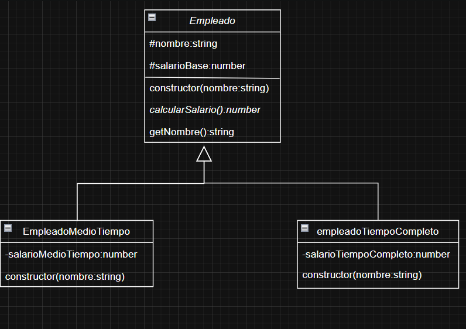

---

### 📁 **src/ej3/README.md**

# Ejercicio 3

## Descripción
Este ejercicio implementa empleados de tiempo completo y medio tiempo.  
El archivo `index.ts` crea un arreglo de empleados y muestra sus sueldos.


# Diagrama realizado para este ejercicio.



## ¿Cómo ejecutar?

```bash
npm run ej3

# o tambien

ts-node src/ej3/index.ts
```

---

# Archivos principales
clases/Empleado.ts: Clase base.
clases/EmpleadoTiempoCompleto.ts, EmpleadoMedioTiempo.ts: Empleados.
arregloEmpleados.ts: Funciones auxiliares.
index.ts: Pruebas del ejercicio.