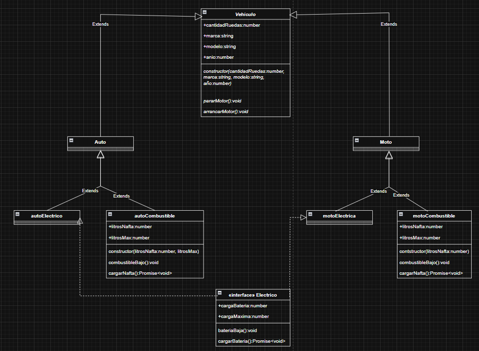

---

### 📁 **src/ej5/README.md**

# Ejercicio 5

## Descripción
Este ejercicio implementa una jerarquía de vehículos (`Auto`, `Moto`, eléctricos y a combustible).  
El archivo `index.ts` crea y prueba instancias de cada tipo, incluyendo la carga de batería para los eléctricos.

# Diagrama realizado para este ejercicio.



## ¿Cómo ejecutar?

```bash
npm run ej5

# o tambien

ts-node src/ej5/index.ts
```
---

# PARA LAS PRUEBAS EN INDEX:

    Hay instancias predeterminadas para cada clase, las cuales se pueden descomentar para probar por separado, asi como tambien cambiar sus parametros.

---

# Archivos principales
clases/Vehiculo.ts, Auto.ts, Moto.ts, etc.: Clases.
interfaces/Electrico.ts: Interfaz.
index.ts: Pruebas del ejercicio.